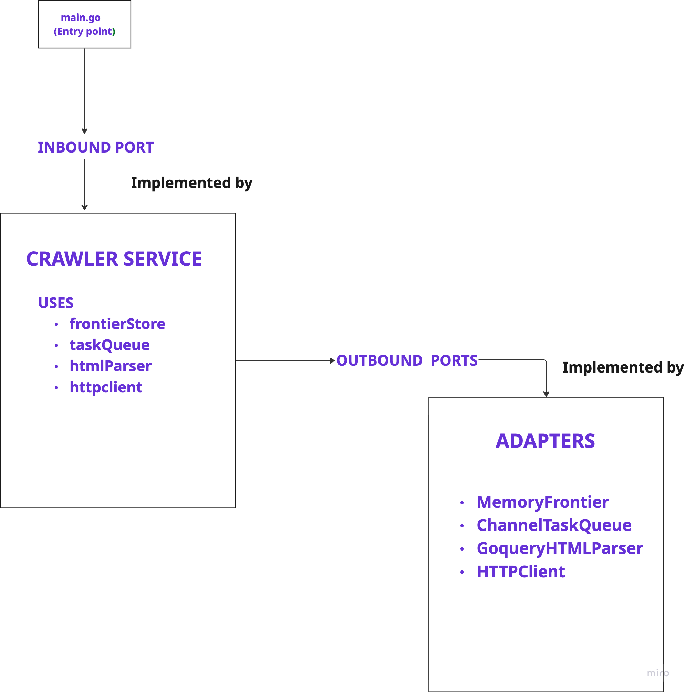

# Web Crawler

A concurrent web crawler written in Go.

## Description

This project is a web crawler designed to traverse websites starting from a given URL. 
It visits pages up to a specified depth, extracting links and storing the visited URLs. 
It supports concurrent crawling with multiple workers.

## Features

- **Concurrent Crawling**: Uses multiple workers to crawl pages in parallel.
- **Depth Control**: Limits the crawl depth to a configurable value.
- **Domain Restriction**: Restricts crawling to the allowed host of the start URL.
- **Politeness**: Configurable HTTP timeout.
- **Stats**: Reports queue size, failed requests, completed requests, and total time taken upon completion.

## Architecture

This project follows the **Hexagonal Architecture** (also known as Ports and Adapters). 
This ensures that the core business logic is isolated from external concerns like the database, network, or user interface.

<p align="center">
  
</p>

- Core (`app/internal/core`)
    - Contains the business logic and domain models. 
    - It defines the "Ports" (interfaces) that the application uses to interact with the outside world.

-  Adapters (`app/internal/adapters`)
   - Contains the implementations of the ports. For example, the HTTP client and the storage mechanism are adapters.

    
## Prerequisites

- Go (version 1.21 or higher recommended)
- Make (optional, for using the Makefile)

## Installation

1. Build the application:
   ```bash
   make build
   ```
   This will create a binary named `web-crawler` in the `bin` directory.

## Usage

### Running with Make

You can run the crawler using the `make run` command. This uses default configuration values defined in the `Makefile`.

```bash
make run
```

To run with custom parameters, you can override the environment variables:

```bash
START_URL=https://crawlme.monzo.com/  MAX_DEPTH=10 WORKERS=10 make run
```


### Configuration

The application is configured via environment variables.

| Variable | Description                                                     | Default (in Makefile) |
| :--- |:----------------------------------------------------------------| :--- |
| `START_URL` | The URL to start crawling from.                                 | `https://crawlme.monzo.com/` |
| `MAX_DEPTH` | The maximum depth to crawl.Crawls the entire site when set to 0 | `5` |
| `WORKERS` | The number of concurrent workers.                               | `10` |
| `HTTP_TIMEOUT` | Timeout for HTTP requests.                                      | `10s` |
| `TASK_QUEUE_BUFFER` | Buffer size for the task queue.                                 | `100` |

## Testing

The project includes comprehensive test coverage with unit and integration tests.

- **Unit Tests**: `make test-unit`
- **Integration Tests**: `make test-integration`
- **All Tests**: `make test-all`
- **Test Coverage**: `make test-coverage` (generates `coverage.html`)
- **Race Detection**: `make test-race`

## Project Structure

- `app/cmd`: Contains the main application entry point.
- `app/internal`: Contains the application logic.
    - `adapters`: Implementations of interfaces (e.g., HTTP client, storage).
    - `config`: Configuration loading logic.
    - `core`: Core domain logic and services.
- `bin`: Directory where the compiled binary is placed.
- `Makefile`: Helper commands for building, running, and testing.


### Sample Full site crawl:

START_URL=https://crawlme.monzo.com/ \
MAX_DEPTH=0 \
WORKERS=50 \
make run

### 42K+ pages, ~1 minute

### Performance

### Benchmark Results

Empirically tested to find optimal configuration across multiple runs:

| Workers | Completed pages | Time (s) | Pages/sec |
|---------| --------------- |----------|-----------|
| 10      | 42,011          | 105.61   | ~398      |
| 20      | 42,011          | 68.55    | ~613      |
| 50      | 42,011          | 56.65    | ~742      |
| 100     | 42,011          | 56.77    | ~740      |
| 1000    | 42,011          | 64.45    | ~652      |


**Key findings:**

- Increasing workers from **10 → 20 → 50** gives clear throughput gains.
- Around **50–100 workers** the crawler effectively saturates resources (network + remote host), and additionals workers don’t help.
- At **1000 workers**, performance degrades slightly due to:
    - goroutine scheduling overhead,
    - contention on shared data structures (frontier + queue),
    - connection limits and throttling on the target host.
